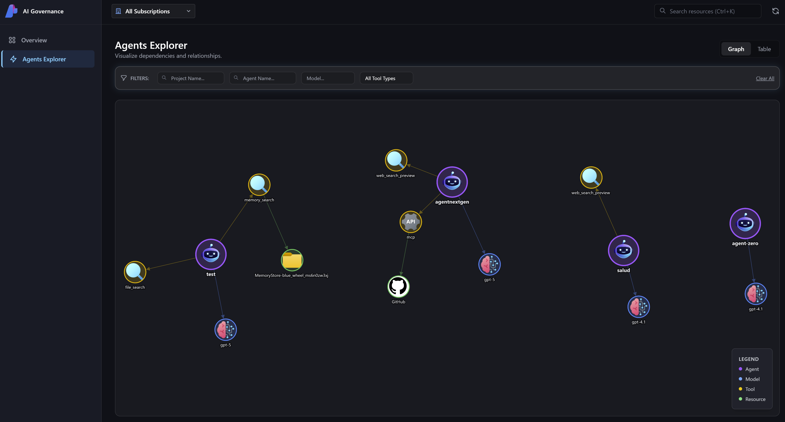
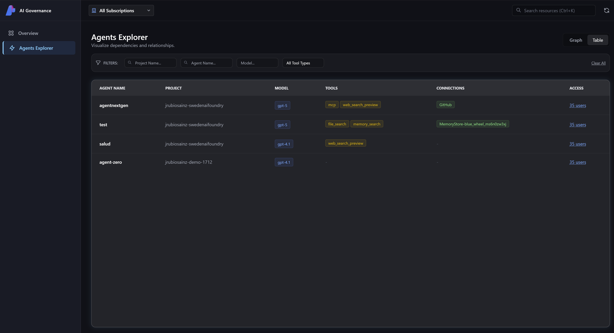
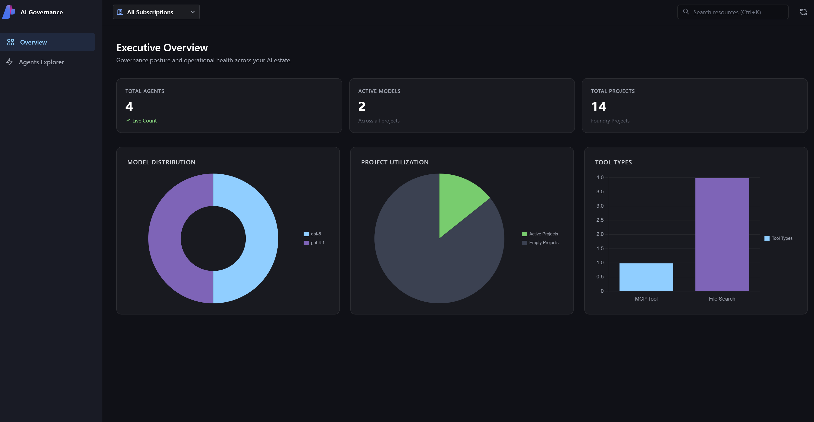

# Azure AI Foundry Agents Governance



**Azure AI Foundry Agents Governance** is a comprehensive visualization and management tool designed to provide transparency and control over your AI Agent estate. 

Unlike standard project-level views, this tool operates at the **Subscription level**, automatically discovering all Azure AI Foundry Hubs and Projects to build a complete inventory of your deployed Agents.

## 🚀 Key Features

*   **🌍 Subscription-Wide Discovery**: Automatically scans your entire Azure subscription to locate every AI Agent across all Foundry Projects and Hubs.
*   **🕸️ Interactive Graph Visualization**: Visualizes complex dependencies between Agents, Models, Tools (File Search, Code Interpreter, MCP), and underlying Azure Resources.
*   **📊 Governance Dashboard**: Provides high-level KPIs on agent proliferation, model usage distribution, and project utilization.
*   **🔍 Deep Inspection**: Drill down into individual agent configurations, including enabled tools, connection strings, and access control (IAM) roles.

## 📸 Screenshots

### Interactive Graph Explorer
Visualize the relationships between your agents and their dependencies.


### Detailed Inventory & Inspection
View tabular data and inspect specific agent configurations.


## 🛠️ Prerequisites

*   **Python 3.8+**
*   **Azure CLI** (installed and logged in)
*   Access to an Azure Subscription with Azure AI Foundry resources.

## 📦 Installation

1.  **Clone the repository**:
    ```bash
    git clone https://github.com/your-username/agents-governance.git
    cd agents-governance
    ```

2.  **Create and activate a virtual environment**:
    ```bash
    python -m venv .venv
    # Windows
    .venv\Scripts\activate
    # Linux/Mac
    source .venv/bin/activate
    ```

3.  **Install dependencies**:
    ```bash
    pip install -r requirements.txt
    ```

4.  **Configure Environment**:
    Create a `.env` file in the root directory (optional, mostly for local overrides):
    ```env
    # Optional: Pre-select a subscription ID if you have many
    # AZURE_SUBSCRIPTION_ID=your-subscription-id
    ```

## 🚦 Usage

1.  **Authenticate with Azure**:
    The tool uses your local Azure CLI credentials to discover resources.
    ```bash
    az login
    ```

2.  **Run the Application**:
    Start the backend server (FastAPI):
    ```bash
    python src/backend/api.py
    ```

3.  **Access the Dashboard**:
    Open your browser and navigate to:
    `http://localhost:8000`

## 🏗️ Architecture

*   **Backend**: Python (FastAPI) with `azure-identity` and `azure-mgmt-*` SDKs for resource discovery.
*   **Frontend**: HTML5, TailwindCSS, and **Cytoscape.js** for graph visualization.
*   **Security**: Runs locally using your Azure CLI credentials; no data is stored externally.

## 🤝 Contributing

Contributions are welcome! Please feel free to submit a Pull Request.
